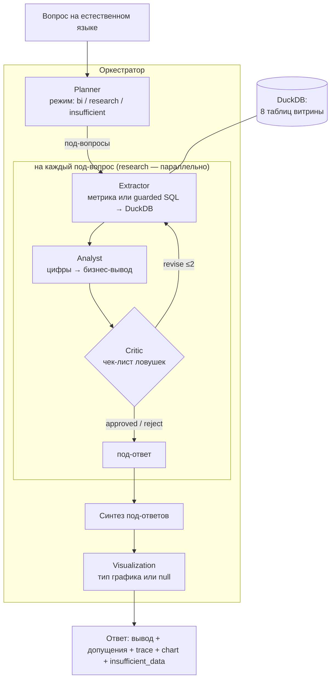

# Meridian — мультиагентная аналитическая система (AI South Hub 2026)

## Требования

- Node 22+
- DuckDB CLI на PATH (`brew install duckdb` или скачайте бинарь со страницы релизов: https://github.com/duckdb/duckdb/releases)

## Установка и БД

```bash
npm install
bash db/build.sh
```

`db/build.sh` собирает `db/meridian.duckdb` из `data/*.csv`.

## Тесты

```bash
npm test        # все юнит/e2e тесты — детерминированы, без LLM-ключа
npm run typecheck
```

## Запуск (нужен LLM-ключ)

```bash
cp .env.example .env   # заполнить LLM_API_KEY / LLM_BASE_URL / LLM_MODEL
npm start
```

Пример запроса:

```bash
curl -s localhost:8000/api/chat \
  -H 'content-type: application/json' \
  -d '{"message":"покажи выручку по продуктовым линиям"}'
```

## Веб-интерфейс (этап 5)

После `npm start` открыть http://localhost:8000 — три режима:
- **Диалоговый BI** — чат с удержанием контекста диалога.
- **Ad-hoc исследование** — сложный вопрос → декомпозиция + мини-исследование.
- **Отчёты по расписанию** — авто-сборка дашборда здоровья (cron `SCHEDULE_CRON`, по умолчанию пн 9:00) + кнопка «Собрать сейчас». Доставка: инбокс + опц. webhook/Telegram (см. `.env.example`).

Для демо частого срабатывания планировщика: `SCHEDULE_CRON="*/2 * * * *" npm start`.

## Архитектура

**Стек:** Node.js/TypeScript · Fastify · OpenAI-совместимый клиент → **YandexGPT 5.1** · **DuckDB** (read-only) · Chart.js. Развёрнуто в Yandex Cloud (Docker), публичный HTTPS: `https://team-004.aisouthhack.ru`.

Полная версия (с потоком данных и обоснованиями) — в [docs/architecture.md](docs/architecture.md).

### Схема



### Четыре агента + оркестратор

| Агент | Файл | Ответственность |
|---|---|---|
| **Planner** | `src/agents/planner.ts` | Классифицирует вопрос: `bi` (один срез), `research` (декомпозиция на 2–4 под-вопроса), `insufficient` (поля/таблицы нет). Резолвит контекст диалога и неоднозначность (трактовка + допущение, а не отказ). |
| **Extractor** | `src/agents/extractor.ts` | Выбирает проверенную **метрику** из библиотеки (~36 шт.) или генерирует **guarded SQL**; исполняет на DuckDB, возвращает строки + оценку достаточности. |
| **Analyst** | `src/agents/analyst.ts` | Строки → бизнес-вывод: тезис, ключевые цифры, «что это значит», компромиссы, допущения. Имена таблиц/полей БД в ответ не попадают. |
| **Critic** | `src/agents/critic.ts` | Чек-лист ловушек (тот ли срез, фильтр `status`, смешение `orders`/`financials`, галлюцинации, ложный отказ). Вердикт `approved`/`revise` (→ доработка с guidance, ≤2)/`reject`. |
| **Visualization** | `src/agents/visualizer.ts` | Тип графика под данные (line/bar/pie) или `null`. |
| **Оркестратор** | `src/orchestrator.ts` | Маршрутизация по режиму; передача контекста диалога Планнеру (`SessionStore`); петля Критика с **keep-best** (≤2); research-под-вопросы **параллельно**; синтез; `insufficient_data`. |

### Ключевые решения

- **DuckDB read-only + guard-rails** — только `SELECT/WITH`, белый список таблиц, авто-LIMIT, таймаут → витрину не испортить, SQL-инъекция отбита, нет 500.
- **Гибрид: ~36 метрик + guarded free-SQL** → точность на частых вопросах и широта на остальных.
- **Critic с реальной петлёй + keep-best** → самокоррекция, но спорная ревизия не деградирует уже верный ответ.
- **Контекст диалога только у Planner** (`src/session/store.ts`); агенты-исполнители stateless → легко параллелить.
- **Honest-by-default**: нет данных → `insufficient_data`; неоднозначно → трактовка + допущение (дисциплина границ).
- **Никогда не 500 / не висеть**: try/catch на каждом слое, таймауты LLM (~30 с +ретрай) и пайплайна (~90 с) с graceful-ответом (0/13 провалов стресс-теста).

### Контракт API

`POST /api/chat` (+ алиасы `/api/v1/chat`, `/chat`, `/api/ask`, `/api/query`)
**Запрос:** `{"message": "..."}` (или `query`/`messages`), опц. `session_id`.
**Ответ:** `{response, assumptions[], trace[], chart, insufficient_data, session_id, plan, sub_answers[]}`.
Бонусы: `GET /health`, `GET /openapi.json`, `GET /docs` (Swagger UI), CORS, чат `/`, мониторинг `/monitor`, отчёты `/reports`. Контракты — в `src/contracts/types.ts`.
