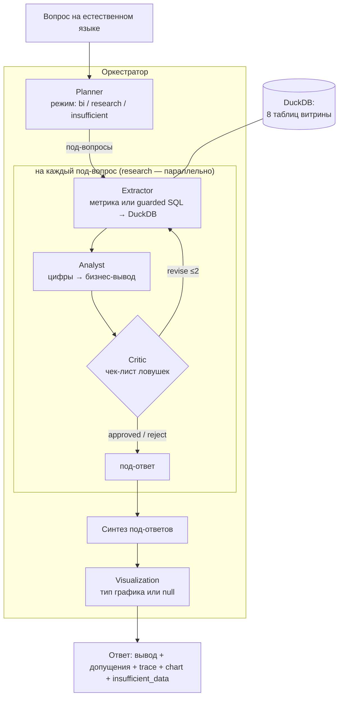

# Архитектура Meridian — мультиагентный AI-аналитик

**Кейс:** диалоговый AI-аналитик данных для совета директоров Meridian (B2B-маркетплейс).
**Стек:** Node.js/TypeScript · Fastify · OpenAI-совместимый клиент → **YandexGPT 5.1** · **DuckDB** (read-only) · Chart.js. Развёрнут в Yandex Cloud (Docker), публичный HTTPS: `https://team-004.aisouthhack.ru`.

## Схема

## Четыре агента (требование кейса) + оркестрация

| Агент | Файл | Ответственность |
|---|---|---|
| **Planner** | `src/agents/planner.ts` | Классифицирует вопрос: `bi` (один срез), `research` (декомпозиция на 2-4 под-вопроса), `insufficient` (нужного поля/таблицы нет). Разрешает контекст диалога и неоднозначность (выбирает трактовку + допущение, а не отказ). |
| **Extractor** (извлечение) | `src/agents/extractor.ts` | По под-вопросу выбирает проверенную **метрику** из библиотеки (24 шт., `src/metrics/library.ts`) или генерирует **guarded SQL**. Исполняет на DuckDB (`src/db/duck.ts`), возвращает строки + честную оценку достаточности данных. |
| **Analyst** | `src/agents/analyst.ts` | Из строк → вывод на языке бизнеса: главный тезис, ключевые цифры, «что это значит», компромиссы между метриками, допущения. |
| **Critic** (валидация) | `src/agents/critic.ts` | Чек-лист: тот ли срез, есть ли фильтр `status`, не смешаны ли `orders`/`financials`, нет ли галлюцинаций, не ложный ли отказ. Вердикт: `approved` / `revise` (→ extractor или analyst, ≤2 раза) / `reject`. |
| **Visualization** | `src/agents/visualizer.ts` | Тип графика под характер данных (динамика → line, сравнение → bar, структура → pie) или `null`, если график не нужен. |
| **Оркестратор** | `src/orchestrator.ts` | Маршрутизация по режиму; loopback Критика (≤2); под-вопросы research — **параллельно** (`Promise.all`); синтез под-ответов; выставление `insufficient_data`. |

## Ключевые решения и «почему»

- **DuckDB read-only + guard-rails** (`src/db/duck.ts`): только `SELECT/WITH`, белый список 8 таблиц, авто-LIMIT, запрет служебных `_*`-объектов, таймаут. → витрину не модифицируем, SQL-инъекции и «утечки» исключены.
- **Библиотека из 24 проверенных метрик** + guarded free-SQL. → точность (готовый верный SQL) и широта (свободные вопросы) одновременно; меньше ложных отказов.
- **Honest-by-default**: `insufficient_data: true`, когда поля/таблицы реально нет; на неоднозначном — трактовка + явное допущение, а не уход от вопроса. → дисциплина границ (15% оценки).
- **Никогда не 500**: каждый слой в try/catch, ошибка агента → деградация к honest-ответу; кривой ввод → 400/422/404. Проверено стресс-тестом (0/13 провалов).
- **Параллельный research**: под-вопросы исполняются одновременно → синтез-вопросы («здоров ли бизнес», «топ-3 риска») не упираются в таймаут.
- **Три режима кейса одной архитектурой:** Диалоговый BI (контекст сессии), Ad-hoc research (декомпозиция+синтез), Отчёты по расписанию (`src/schedules/*` — динамический планировщик, дашборд здоровья + риски + рекомендации).

## Контракт API (для судьи)

`POST /api/chat` (+ алиасы `/api/v1/chat`, `/chat`, `/api/ask`, `/api/query`)
**Запрос:** `{"message": "..."}` (или `query`/`messages`), опц. `session_id`.
**Ответ:** `{response, assumptions[], trace[], chart, insufficient_data, session_id, plan, sub_answers[]}`.
Бонусы: `GET /health`, страница чата `/`, мониторинг `/monitor`, отчёты `/reports`.

## Поток данных (один BI-вопрос)
1. `message` → **Planner** → `{mode:"bi", sub_questions:[q]}`.
2. **Extractor**: метрика `ltv_cac_by_segment` → SQL → DuckDB → строки.
3. **Analyst**: строки → «SMB убыточен (LTV/CAC 0.59)…» + допущения.
4. **Critic**: проверки пройдены → `approved`.
5. **Visualization**: `bar`.
6. Ответ с цифрами, методом (trace), допущениями и графиком.
