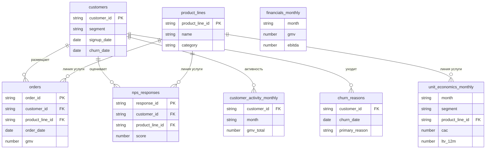

# Карта витрины данных Meridian

Витрина агрегирует 36 месяцев работы B2B-маркетплейса услуг Meridian (январь 2023 — декабрь 2025): сделки, активность и отток клиентов, NPS, юнит-экономику и финансы платформы.

> **Данные доступны как БД DuckDB** — собрать `bash db/build.sh`, запрашивать `duckdb db/meridian.duckdb -c "..."`. Подробности и примеры: [00-database.md](00-database.md).

## ER-диаграмма

Связи: `customers` соединяется с `orders`, `nps_responses`, `customer_activity_monthly` и `churn_reasons` по `customer_id`; `product_lines` — с `orders`, `nps_responses` и `unit_economics_monthly` по `product_line_id`. Таблица `financials_monthly` внешних ключей не имеет — она описывает платформу целиком.

## Гранулярность таблиц

| Таблица | Что = одна строка | Период | Объём строк | Что измеряет |
| --- | --- | --- | --- | --- |
| `customers` | один клиент | справочник | 25000 | профиль клиента: сегмент, индустрия, город, канал привлечения, даты signup/churn |
| `product_lines` | одна линия услуги | справочник | 9 | каталог продуктовых линий: название, категория, дата запуска, статус |
| `orders` | одна сделка | 2023-01-01 … 2025-12-28 | 681305 | транзакции: GMV, выручка, статус, тип провайдера |
| `nps_responses` | один ответ на опрос | 2023-01-21 … 2025-12-19 | 56164 | оценка лояльности NPS: score, категория, тег комментария |
| `customer_activity_monthly` | клиент × месяц | 2023-01 … 2025-12 | 608920 | помесячная активность: число заказов, GMV, дни активности, логины, статус |
| `churn_reasons` | один ушедший клиент | exit-интервью | 8873 | причины оттока: основная причина, упомянутый конкурент, NPS на момент ухода |
| `unit_economics_monthly` | сегмент × линия × месяц | 2023-01 … 2025-12 | 918 | юнит-экономика: CAC, LTV 12 мес, payback, gross margin, take rate, новые клиенты |
| `financials_monthly` | один месяц | 2023-01 … 2025-12 | 36 | финансы платформы: GMV, выручка, take rate, COGS, OPEX, EBITDA, CAPEX, headcount |

## Уровни агрегации

В витрине сосуществуют несколько уровней детализации.

- **Платформа целиком** — `financials_monthly`: одна строка на месяц, агрегат по всему бизнесу без разрезов.
- **Срез сегмент × линия × месяц** — `unit_economics_monthly`: юнит-экономика в разрезе клиентского сегмента и продуктовой линии помесячно.
- **Транзакционный / событийный уровень** — `orders` (одна сделка), `customer_activity_monthly` (клиент × месяц) и `nps_responses` (один ответ на опрос): самая мелкая зернистость данных.
- **Справочники** — `customers` и `product_lines`: измерения, к которым присоединяются факты.
- **Exit-интервью** — `churn_reasons`: одна строка на ушедшего клиента с причинами оттока.

## Полные схемы

Полное описание колонок всех таблиц см. в [`../data-dictionary.md`](../data-dictionary.md).
